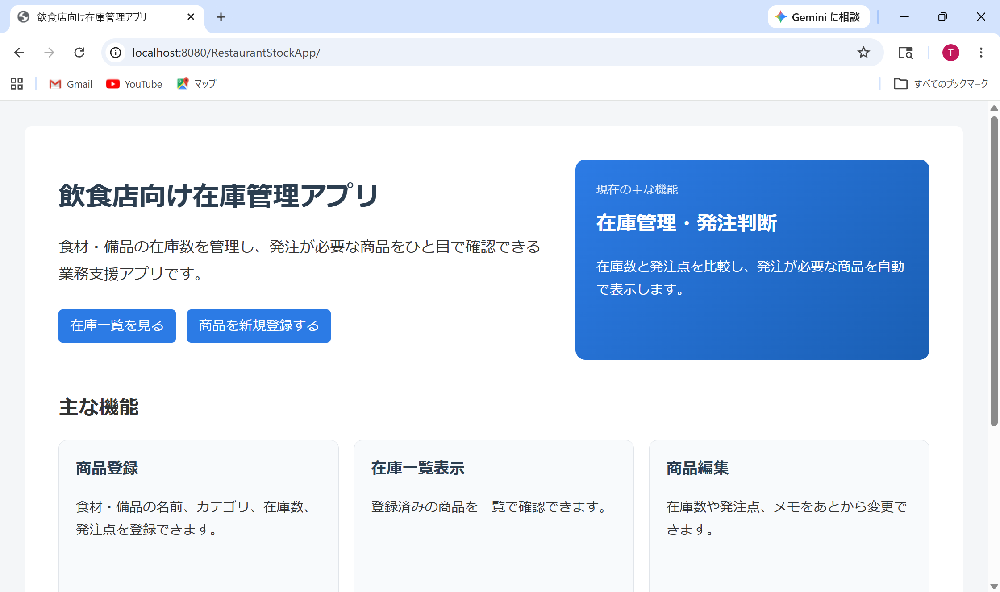
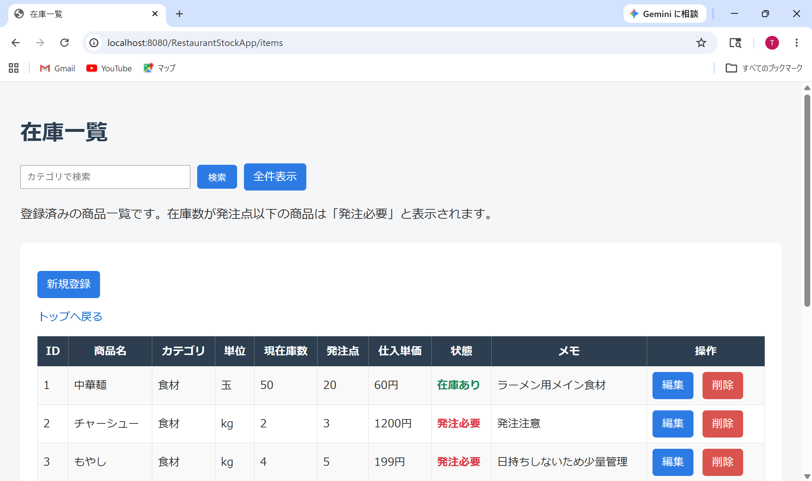
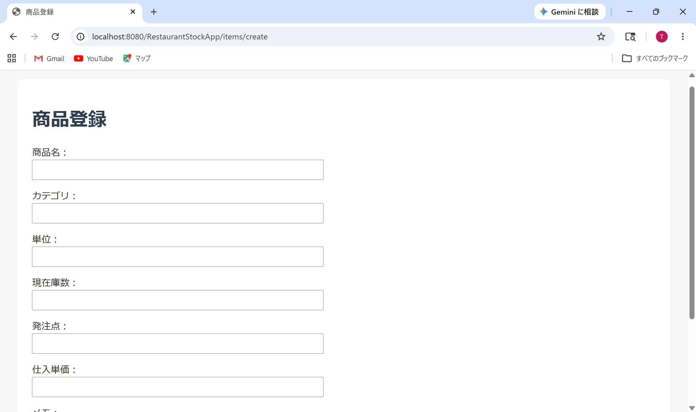
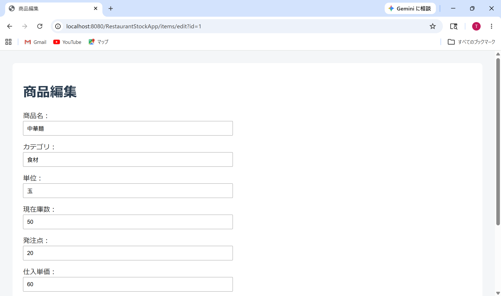

# 飲食店向け在庫管理アプリ

## 概要

飲食店で使用する食材・備品の在庫数を管理し、在庫数が発注点以下になった商品を「発注必要」として表示するWebアプリです。

前職で飲食店の店長業務に携わる中で、在庫確認や発注判断が担当者の経験に依存しやすいと感じたため、在庫状況を一覧で確認できるアプリとして作成しました。

## 作成背景

飲食店では、食材や備品の在庫確認、発注判断、発注漏れ防止が重要です。

しかし、紙やExcelで管理している場合、確認漏れや担当者ごとの判断差が発生しやすいと感じていました。

そこで、商品ごとに現在庫数と発注点を登録し、発注が必要な商品を自動で判定できる在庫管理アプリを作成しました。

## 使用技術

* Java
* JSP
* Servlet
* JDBC
* MySQL
* HTML
* CSS
* Apache Tomcat
* Eclipse

## 主な機能

### 在庫一覧表示

登録されている商品を一覧で表示します。

表示項目：

* 商品ID
* 商品名
* カテゴリ
* 単位
* 現在庫数
* 発注点
* 仕入単価
* 状態
* メモ

### 商品登録

食材や備品を新規登録できます。

登録項目：

* 商品名
* カテゴリ
* 単位
* 現在庫数
* 発注点
* 仕入単価
* メモ

### 商品編集

登録済みの商品情報を編集できます。

在庫数や発注点を変更することで、現在の在庫状況に合わせた管理ができます。

### 商品削除

不要になった商品データを削除できます。

### 発注アラート表示

現在庫数が発注点以下になった場合、状態欄に「発注必要」と表示します。

例：

```text
現在庫数 <= 発注点 → 発注必要
現在庫数 > 発注点 → 在庫あり
```

### カテゴリ検索

カテゴリ名で商品を絞り込みできます。

例：

* 食材
* 調味料
* 備品

## データベース設計

### items テーブル

| カラム名           | 型         | 内容   |
| -------------- | --------- | ---- |
| id             | INT       | 商品ID |
| name           | VARCHAR   | 商品名  |
| category       | VARCHAR   | カテゴリ |
| unit           | VARCHAR   | 単位   |
| stock_quantity | INT       | 現在庫数 |
| reorder_point  | INT       | 発注点  |
| purchase_price | INT       | 仕入単価 |
| memo           | VARCHAR   | メモ   |
| created_at     | TIMESTAMP | 登録日時 |
| updated_at     | TIMESTAMP | 更新日時 |

## 工夫した点

* 前職の飲食店経験をもとに、実務で使う在庫管理・発注判断をテーマにしました。
* Java Servlet / JSP を使い、一覧表示・登録・編集・削除のCRUD機能を実装しました。
* DAOクラスを作成し、ServletとSQL処理を分離しました。
* 現在庫数と発注点を比較し、発注が必要な商品を自動判定するようにしました。
* CSSを使用し、業務アプリらしい見た目になるように調整しました。

## アプリ画面

### TOP画面



### 在庫一覧画面



### 商品登録画面



### 商品編集画面



### TOP画面

飲食店向け在庫管理アプリの概要と、在庫一覧・商品登録への導線を表示します。

### 在庫一覧画面

登録されている商品を一覧表示し、発注が必要な商品は赤色で表示します。

### 商品登録画面

新しい商品を登録できます。

### 商品編集画面

既存の商品情報を編集できます。

## 今後追加したい機能

* 発注必要商品のみを表示する機能
* CSV出力機能
* 入出庫履歴管理
* ログイン機能
* 月別使用量の集計
* 原価率計算

## アピールポイント

このアプリは、単なる学習用アプリではなく、前職の飲食店勤務経験をもとにした業務改善アプリです。

在庫管理や発注判断という現場課題を、JavaとMySQLを使ってWebアプリとして形にしました。

未経験からのIT転職に向けて、以下の点を意識して作成しました。

* JavaでWebアプリを作成できること
* MySQLを使ったデータ管理ができること
* CRUD処理を実装できること
* 業務課題をシステム化する視点を持っていること
* 前職の経験をIT分野に活かせること

## 実行環境

* Java
* Apache Tomcat
* MySQL
* Eclipse
* MySQL Workbench

## 作者

Taku Yamazaki
飲食店での店長経験を活かし、実務課題をITで解決することを意識して作成しました。
